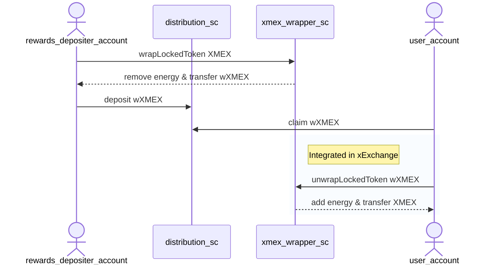
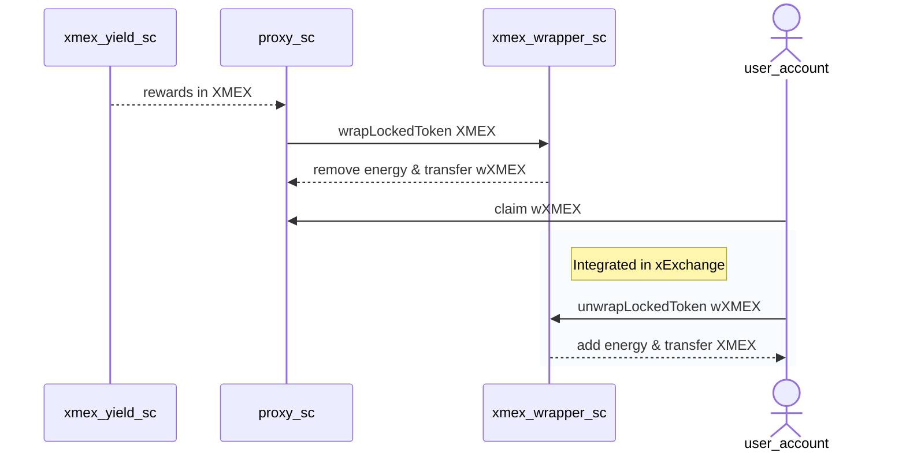

[comment]: # (mx-exclude-context)

# XMEX transferability in community projects

Projects developing on top of xExchange smart contracts might need the ability to work with XMEX, either acting as proxy to transfer it from/to the xExchange yield generating contracts, or by accepting it as means of payment for specific business cases. Many of the core principles of XMEX are designed around its account binding property, which in this case removed the open transferability of XMEX. For this reason, we have designed an XMEX transfer mechanisms for projects to use, in order to assure and streamline the conservation of the XMEX benefits and properties without too much development effort required on implementing project's side.

[comment]: # (mx-context-auto)

## Transfer method and specifications

On each xExchange environment we have deployed an [XMEX wrapping contract](https://github.com/multiversx/mx-exchange-sc/tree/main/locked-asset/locked-token-wrapper) to facilitate the transferability for implementing projects. The XMEX wrapping contract accepts XMEX, removes its energy and properties from the sender and gives back WXMEX. The WXMEX token does not hold energy or benefits in its wrapped form, apart from it's ability to be transfered if the holder address is whitelisted. 
Therefore, the implementing projects will receive transferRole on the WXMEX tokenID on needed addresses, if their business criteria is accepted as in sync with the principles of XMEX.

The whitelisted projects will need to wrap the XMEX they want to deposit or use. By wrapping it, the XMEX will temporarily “lose” its energy but the energy can be recovered and regained by users unWrap.

Projects will be able to use the wrappedXMEX to distribute it from their Smart Contracts to its users. Users who will get/claim wrappedXMEX will need to unWrap it in order to convert it back to XMEX and gain its original energy and full benefits.

[comment]: # (mx-context-auto)

### Deployed contracts

| Environment | XMEX wrapping smart contract address |
|-------------|------------------------------------------------|
| Mainnet: | `erd1qqqqqqqqqqqqqpgqu64gygjs5ted4rupaewaszyhaxl9lv7m2jpsw47nzr` |
| Devnet: | `erd1qqqqqqqqqqqqqpgqasr2asq07e6ur274eecx3vd0pnej2vxs0n4sqqyp52` |
| Testnet: | `erd1qqqqqqqqqqqqqpgqs9c75ev7kzttp33gq0868qcwynv2ajgt0n4s9k628r` |

[comment]: # (mx-context-auto)

### Usage flows

The wrapping can be done either by an user account or by a smart contract. This opens two major XMEX usage flows:

**User wraps then deposits into a distribution smart contract**

- rewards_depositer_account - user account from project side that should deposit rewards in the project's distribution smart contract
- distribution_sc - project's distribution smart contract that will receive transfer role for wrappedXMEX
- xmex_wrapper_sc - xmex wrapper smart contract owned by xExchange owner entity
- user_account - end user account that claims and uses the distributed rewards

**Smart contract wraps and distributes**

- proxy_sc - project's smart contract that will receive transfer role for wrappedXMEX
- xmex_yield_sc - contract generating XMEX rewards
- xmex_wrapper_sc - xmex wrapper smart contract owned by xExchange owner entity
- user_account - end user account that claims and uses the distributed rewards

[comment]: # (mx-context-auto)

## Whitelisting process and criteria

Implementing projects have to make a pull request in [the mx-specs repository](https://github.com/multiversx/mx-specs) containing a new file in the `LKMEX-whitelist` folder. The new file should contain the filled data required by the template you can find in [the last chapter of this page](#template-for-pr-contents). The name of the document should be the name of the project.

Projects can also lose their transferRole status if the Smart Contract is being used in ways that go against LKMEX principles. Questionable activities will be reviewed by the MultiversX team and any Project or Smart Contract found in breach of the rules will automatically lose their transferRole status.

We will consider eligibility for transferRole only for projects and smart contracts serving as catalysts for user adoption and those who bring valuable use cases. Use cases that go against the principles of XMEX outlined in the [xExchange economics paper](https://xexchange.com/x-exchange-economics.pdf), where XMEX rules and properties are overridden, re-enabling transferability, selling or buying will not be eligible.

::: note Important 
In order to protect the core principles of XMEX, the xExchange team will review each project use case and smart contract code. 
Thus, to ensure safety, projects may lose the transferRole after upgrading their smart contract without prior notification or reasoning, until further review of the new code.
In order to avoid downtime suffered as a consequence of this, projects are advised to make a new pull request before their planned smart contract upgrades, where new code updates brought to the smart contract must be explained and motivated.
:::

[comment]: # (mx-context-auto)

## Template for PR contents

## Name of the project
[Fill in]

## Description of the project
[What does the project do?]

## Purpose
[Why does the project need a transfer role for XMEX?]

## Address of Smart Contract
[address][link on explorer]

## Smart Contract Code
[Post link to github for our internal review]

## Description for every Smart Contract functionality
[Description and link to pieces of code is highly appreciated]

## Number of users
[Fill in]

## Average LKMEX/XMEX used during the previous month
[Fill in]